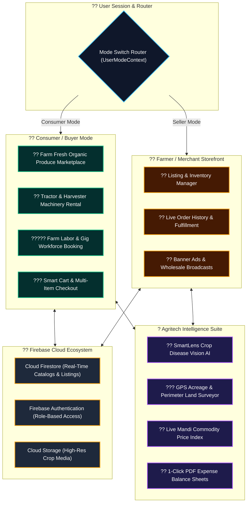

<div align="center">

# ?? FARMCAP SUPERAPP (MY-FIRST-APP)
### *Next-Gen Dual-Mode Agri-Commerce, Machinery Rental & SmartLens AI Ecosystem*

[](https://react.dev)
[](https://vitejs.dev)
[](https://firebase.google.com)
[](https://leafletjs.com)
[](https://ai.google.dev)
[](LICENSE)

<br/>

<p align="center">
  <a href="#-dual-mode-architecture"><b>Dual-Mode Engine</b></a> •
  <a href="#-system-architecture"><b>Architecture</b></a> •
  <a href="#-key-marketplace-pillars"><b>Marketplace Pillars</b></a> •
  <a href="#-smartlens-ai"><b>SmartLens AI</b></a> •
  <a href="#-quick-start"><b>Quick Start</b></a>
</p>

---

</div>

## ?? Executive Summary

**FarmCap SuperApp** is a comprehensive rural commerce and agritech platform built to eliminate intermediaries between farmers, equipment owners, agricultural laborers, and consumers.

Featuring a seamless **Dual-Mode System Router**, users can toggle with one tap between **Consumer/Buyer Mode** (buying farm-fresh organic produce, hiring tractors/harvesters, booking field laborers) and **Farmer/Seller Storefront** (managing inventory listings, monitoring incoming orders, broadcasting bulk harvests, and advertising services).

---

## ??? System Architecture



---

## ?? Key Marketplace Pillars & Capabilities

<table>
  <tr>
    <td width="50%" valign="top">
      <h3>?? Farm Machinery & Equipment Hire</h3>
      <ul>
        <li><b>Hourly / Daily Rentals:</b> Rent tractors, combine harvesters, seed drills, and power tillers from neighboring farms.</li>
        <li><b>Equipment Specifications:</b> Horsepower, fuel capacity, driver availability, and location radius filters.</li>
        <li><b>Cost Reduction:</b> Helps smallholder farmers access expensive machinery without heavy capital debt.</li>
      </ul>
    </td>
    <td width="50%" valign="top">
      <h3>????? Agricultural Workforce & Gigs</h3>
      <ul>
        <li><b>Labor Booking:</b> Hire skilled field laborers for sowing, weeding, harvesting, and pest spraying.</li>
        <li><b>Wage Transparency:</b> Verified daily wage rates and transparent booking confirmation.</li>
        <li><b>Seasonal Availability:</b> Solves critical labor shortages during peak harvest windows.</li>
      </ul>
    </td>
  </tr>
  <tr>
    <td width="50%" valign="top">
      <h3>?? Direct Farm Fresh Marketplace</h3>
      <ul>
        <li><b>Zero Middlemen:</b> Direct farmer-to-consumer commerce with fair pricing for growers and fresh food for buyers.</li>
        <li><b>Multi-Category Catalog:</b> Grains, pulses, organic vegetables, dairy, honey, and local artisanal goods.</li>
        <li><b>Order Tracking:</b> Real-time status updates from harvest pickup to doorstep delivery.</li>
      </ul>
    </td>
    <td width="50%" valign="top">
      <h3>?? SmartLens Vision AI & Tools</h3>
      <ul>
        <li><b>Visual Disease Scanner:</b> Upload plant photos to instantly identify leaf blight, rust, and pests.</li>
        <li><b>GPS Land Surveyor:</b> Accurate perimeter measurement with satellite overlay.</li>
        <li><b>Expense Ledger:</b> Track inputs, yields, and export PDF profit & loss reports.</li>
      </ul>
    </td>
  </tr>
</table>

---

## ?? Quick Start & Installation

### Prerequisites
* **Node.js** `v18+` & **npm**

```bash
# 1. Clone the repository
git clone https://github.com/maniscap/My-First-App.git
cd My-First-App

# 2. Install dependencies
npm install

# 3. Launch development server
npm run dev
```

Open **`http://localhost:5173`** in your browser to start using the SuperApp!

---

## ?? Repository Structure

```
My-First-App/
+-- public/
+-- src/
¦   +-- components/
¦   ¦   +-- Consumer/           # ?? Consumer pages (FarmFresh, HireMachinery, HireWorkers, Cart)
¦   ¦   +-- Seller/             # ?? Seller pages (ManageListings, StorefrontSetup, OrderHistory)
¦   ¦   +-- SmartLens.jsx       # ?? AI Crop Disease Scanner
¦   ¦   +-- GPSMeasurement.jsx  # ??? GPS Land & Acreage Surveyor
¦   ¦   +-- MarketRates.jsx     # ?? Live Mandi Commodity Price Index
¦   ¦   +-- CropExpenses.jsx    # ?? Expense Tracker & PDF Export
¦   ¦   +-- ChatBot.jsx         # ?? AI Farm Advisor
¦   +-- context/
¦   ¦   +-- UserModeContext.jsx # ?? Consumer vs. Seller mode state provider
¦   +-- firebase.js             # ?? Firestore & Authentication setup
¦   +-- App.jsx                 # ?? Root application component & routes
¦   +-- index.css               # ?? Design system tokens
+-- index.html
+-- package.json
+-- vite.config.js
```

---

<div align="center">
  <sub>Engineered with precision for rural digital empowerment. FarmCap SuperApp Suite &copy; 2026 Mani.</sub>
</div>
